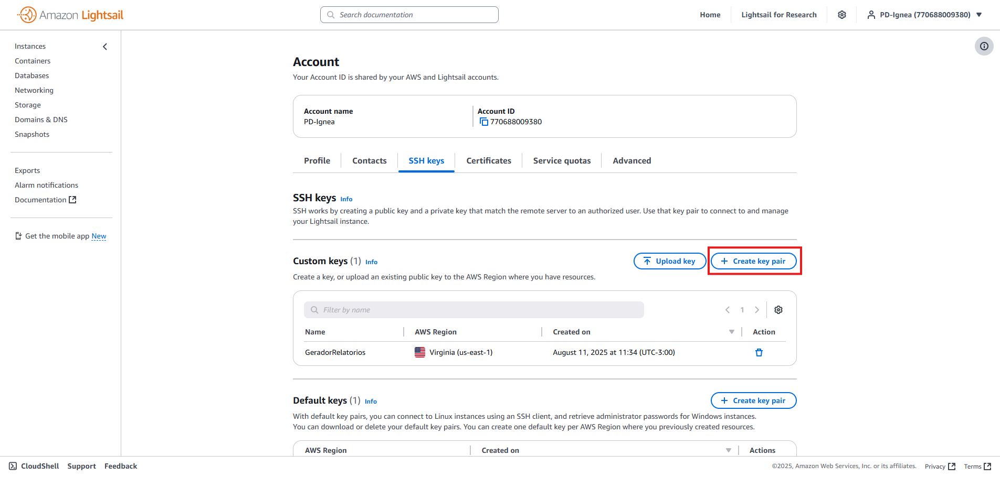
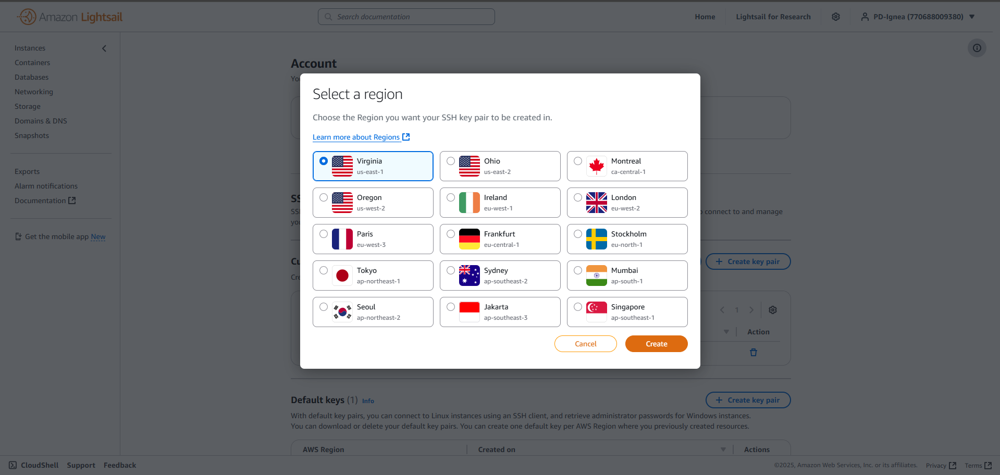
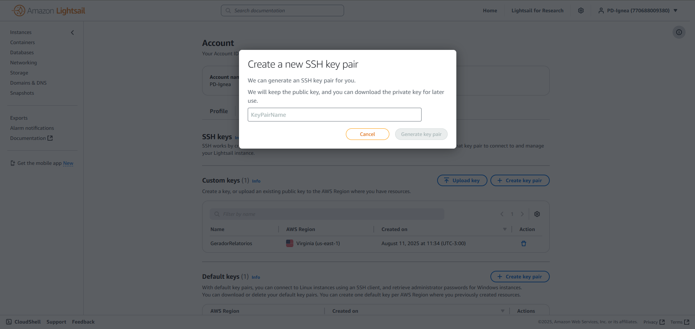
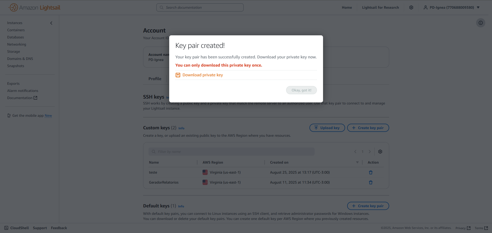

# AWS (Lightsail) — Guia de Uso da Plataforma

Guia para operar a infraestrutura na **AWS (Lightsail)**.

---

## Conta, Região e Escopo

- **Conta & credenciais**: disponíveis no **Discord**.
- **Região padrão**: quando possível, **Brasil (sa-east-1)**; caso não, **N. Virginia (us-east-1, Zone A / us-east-1a)** por ser o segundo mais próximo.
- **Serviço utilizado**: **Lightsail** (compute + banco gerenciado).

---

## Recursos em uso (hoje)

| Recurso | Tipo | Nome/Identificação | Região/AZ | IP |
|---|---|---|---|---|
| Instância de aplicação | Lightsail (Linux) | **GeradorRelatoriosV2** | us-east-1a | **34.205.142.142** (IP estático) |
| Banco de dados | Lightsail Managed DB | **GeradorRelatoriosDatabase** | us-east-1a | Endereço/porta via `.env` |

> **Aplicação**: 2 contêineres Docker — **backend + servidor de estáticos** e **LibreOffice (lo-runner)**.  
> **Banco**: **Lightsail Managed Database**; informações de conexão em **`.env` do Gerador de Relatórios no Discord**.

---

## Acesso

### Console AWS
1. Acesse o **Console AWS** com as credenciais do **Discord** como root.  
2. Abra **Lightsail** → **Instâncias** → **GeradorRelatoriosV2**.

### SSH na Instância
- **Usuário**: `ubuntu`  
- **Autenticação**: chave `.pem` (public key) do Lightsail (armazenada na conta/região)  
  - Para mais informações sobre a public key veja [Publickey](#publickey).
- **Comando (exemplo)**:
  ```bash
  ssh -i /caminho/sua-chave-lightsail.pem ubuntu@34.205.142.142
  ```
- **Diretório do app**: `/home/ubuntu/app`

> Se necessário, use o **browser-based SSH** do próprio Lightsail (botão **Connect** na página da instância).


### Uso e Deploy
Para informações de uso, deploy e um exemplo de como foi feito esse procesos até agora, veja a documentação do [Gerador de Relatórios](https://github.com/IGNEA-comporativo/GeradorDeRelatorios).

---


## Custos — **atenção**

```{warning}
**Monitore custos continuamente.**  
Instâncias **Lightsail** e **bancos gerenciados** cobram **por hora** caso se ultrapasse os recursos contratados no plano e podem crescer com **armazenamento**, **transferência de dados** e **snapshots**.  
- **Acompanhamento**: verificar periodicamente o **custo mensal** e **previsão** no Console AWS.  
- **Dimensionamento**: valide se o plano da instância e o tamanho do banco estão **adequados** à demanda.  
- **Dados/egresso**: altas transferências podem **elevar custos**; monitore tráfego e políticas de retenção de logs.  
- **Snapshots**: gere com parcimônia e **apague** os desnecessários.
```

**Informações**:
- Já existem **alertas de custo** (Budget) estabelecidos, mas sua manutenção e verificação devem ser mantidos e revisados.  

---

## Diagrama simples (visão atual)
Destaca-se os serviços em uso atual na AWS lightsail.
```{mermaid}
flowchart TD
    A[Dev local] --> B[Build & Testcompose.prod.cloud.yaml]
    B --> C[Docker Hub   backend-vX, lo-runner-vX]
    C --> D[Lightsail  GeradorRelatoriosV2]
    D --> E[home/ubuntu/app compose.cloud.yaml]
    E --> F[Containers:  backend+static, lo-runner]
    D --> G[Lightsail DB:  .env no Discord]
```

---

## PublicKey
Para acessar uma instância da AWS Lightsail via SSH ou enviar arquivos via SCP é preciso criar uma `publickey`. Essa é a chave que dá acesso a máquina, uma vez que o lightsail não define uma senha pra SSH. 

Para criar uma `publickey` acesse: 
1. https://lightsail.aws.amazon.com/ls/webapp/account/keys .
2. Crie uma par de chave de acesso

3. Selecione a região da instância

4. Defina um nome para sua chave e crie

5. Faça um download da chave

6. Você irá baixar um arquivo `.pem`. 

Você deve deixá-lo em um lugar de fácil acesso. O caminho padrão (tanto no linux-wsl quanto no windows) é `~/.ssh/<nome_da_chave>.pem`, o recomendado é colocá-la nesse lugar. 

Quando for utilizar ssh ou scp faça da seguinte forma:
```bash
ssh -i ~/.ssh/<nome_da_chave>.pem <ip>

scp -i ~/.ssh/<nome_da_chave>.pem <arquivo1> <arquivo2>
```
